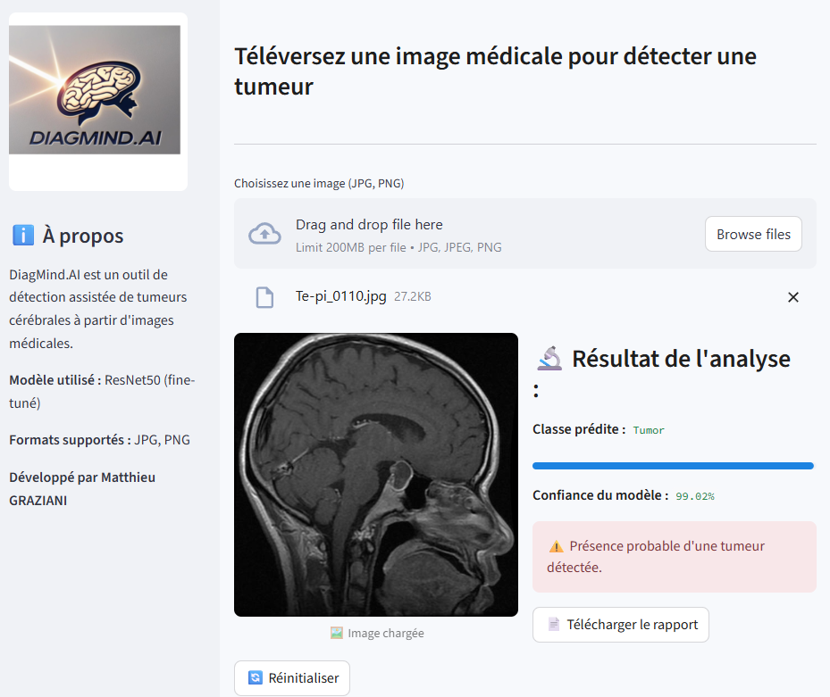

# <p align="center">Projet IA - Deep Learning</p>
# <p align="center">DiagMind.AI</p>
# 📸 Aide aux Diagnostique en Imagerie Médicale

---

## 🧠 Présentation

Ce projet a pour objectif de développer des outils et des ressources pour assister les professionnels de santé dans l’analyse, l’interprétation et le diagnostic d’images médicales (radiographies, IRM, scanners, échographies, etc.).

Grâce à l’intelligence artificielle, à la vision par ordinateur et à des modèles d'apprentissage automatique, notre solution vise à :
- Accélérer le processus de diagnostic
- Réduire les erreurs d'interprétation
- Offrir un second avis automatisé
- Améliorer la formation des radiologues et cliniciens

---

## 🧰 Fonctionnalités

- 🔍 Détection automatique d’anomalies : lésions cérébrales
- 🧬 Classification d’images selon les pathologies
- 🌐 Interface web conviviale pour l’analyse
- 🔒 Respect de la confidentialité des données médicales (anonymisation)

---
## 📚 Sources de données


---
## 📁 Structure du projet

```bash
.
├── images/               # Images
├── models/               # Modèles entrainés
├── styles/               # CSS de l'appplication Streamlit  
├── EDA.ipynb             # Analyse Exploratoire des Données          
├── DiagMind_AI.ipynb     # Notebook du DL
├── app.py                # Application Streamlit
├── README.md             # Ce fichier
└── requirements.txt      # Dépendances Python
````

---

## 🚀 Installation

### 1. Clonez le dépôt :

```bash
gh repo clone matthieugraziani/Deep-Learning
cd Deep-Learning
```

### 2. Créez un environnement virtuel :

```bash
python -m venv venv
source venv/bin/activate  # sous Windows: venv\Scripts\activate
```

### 3. Installez les dépendances :

```bash
pip install -r requirements.txt
```

### 4.Lancer Streamlit :

```bash
streamlit run app.py
```

### 5.Apercu de l'appli



---

## ✅ À faire
* [ ] Grad-Cam 
* [ ] Export PDF du rapport médical
* [ ] Prise en charge des  fichiers DICOM
* [ ] Validation clinique avec un radiologue

---

## 📬 Contact

Pour toute question, suggestion ou contribution :

📧 matthieu.graziani007@gmail.com
🌐 

```
